# CTFd Plugins
This repo includes three plugins for [CTFd](https://github.com/CTFd/CTFd). Each of them can be used independently.

_!!haven't been tested in production yet!!_

---

# challenges_download plugin

### Features

You can download challenges and then upload them to another instance of CTFd.
Serializes chosen challenge and creates ZIP archive of its content and files.
This plugin is useful for backing up challenges.

Requirements:
 - zipfile

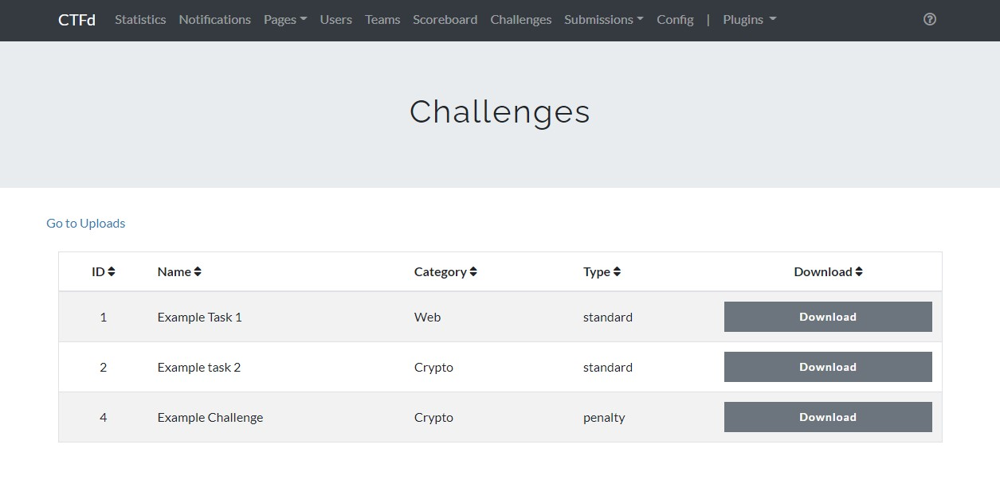
_Downloads Page_

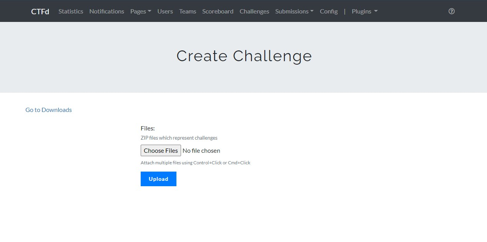
_Uploads Page_

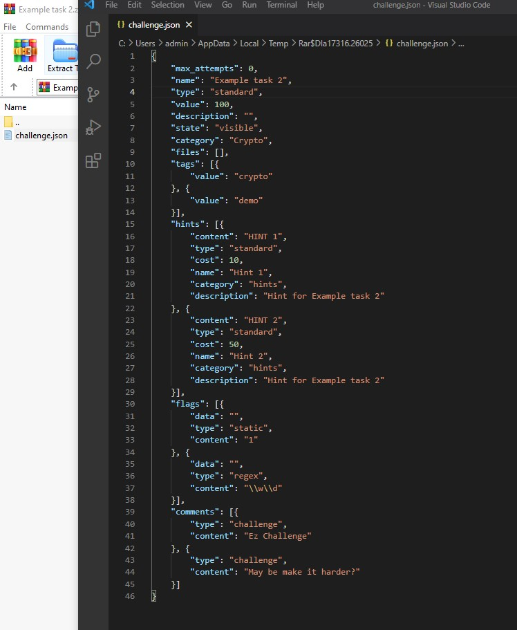
_Example Challenge Serialized_

---

# penalties plugin

### Features

Adds new challenge type. 
This new type has a penalty property 
which decreases the amount of points user gets for solving a challenge.
Penalty can be turned on/off. This plugin can be used for 
challenges that must be solved in the certain amount of time, 
but the penalty has to be activated manually.

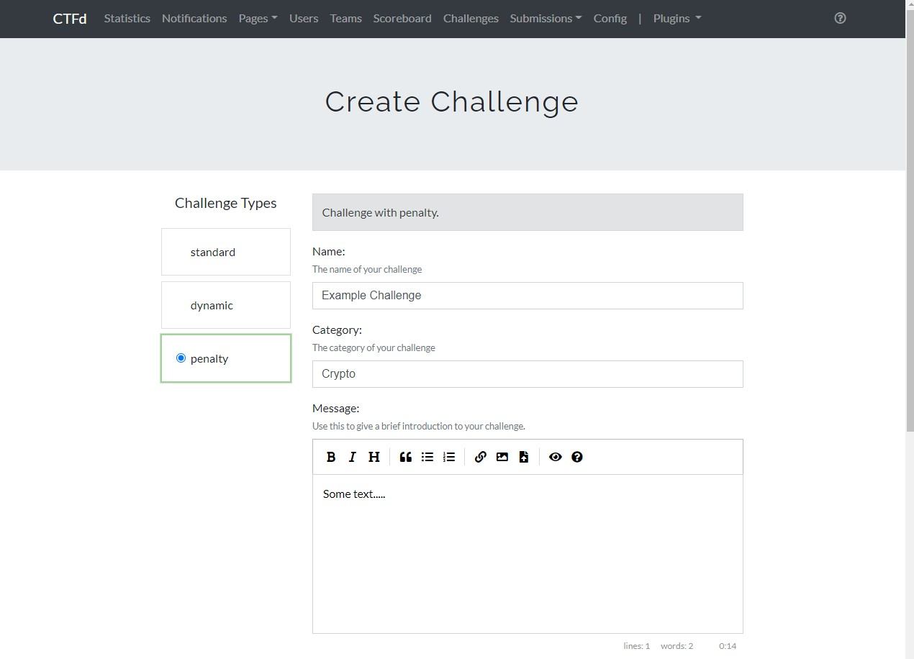

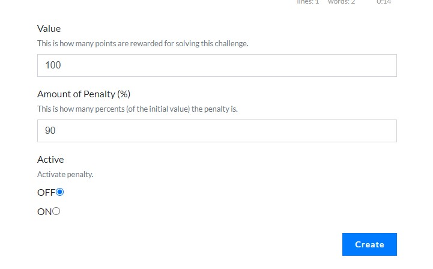
_Creation Page_

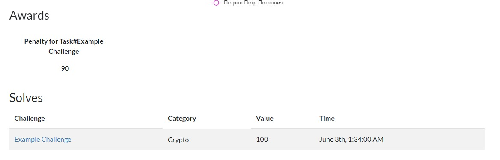
_Applied penalty_

---

# group_management plugin

_This plugin was made to make CTFd suitable for education at the university courses._

### Features

Adds a "group" organizational unit. 
A group consists of several teams. Before user can proceed to the challenges he/she has to choose a group.
Admin can set groups active/inactive so that users can or cannot proceed to the challenges page.
Also, admin can create users (students) in a bunch by copy-pasting an Excel table into import section.

_Caution: his plugin overrides setup page and forces Team mode._

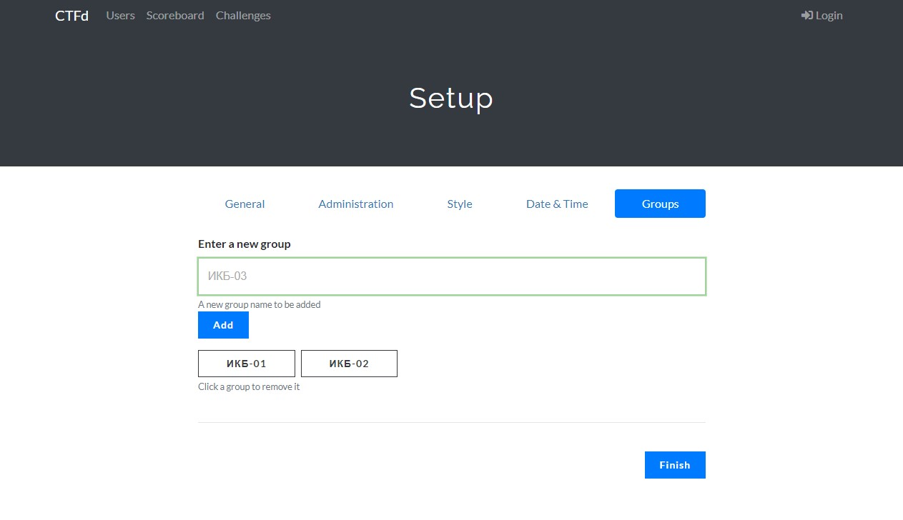
_Setup Page_

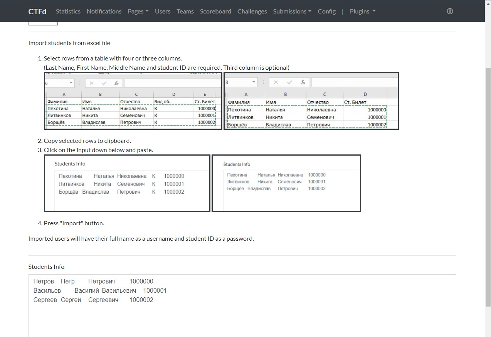
_Import Users Page_

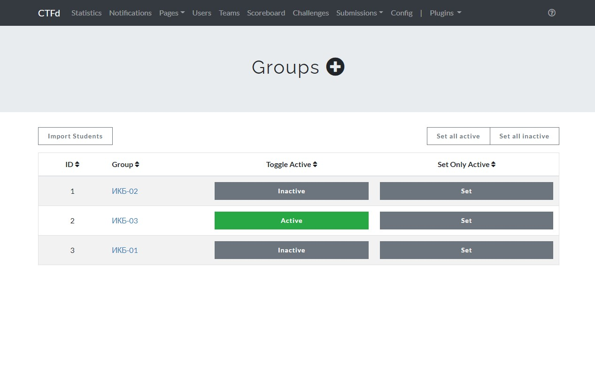
_Group listing_

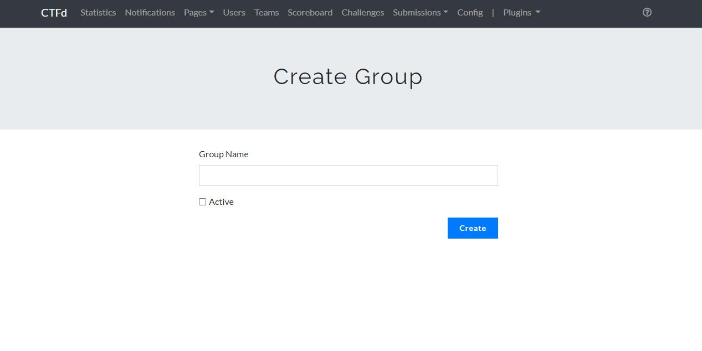
_New group creation_

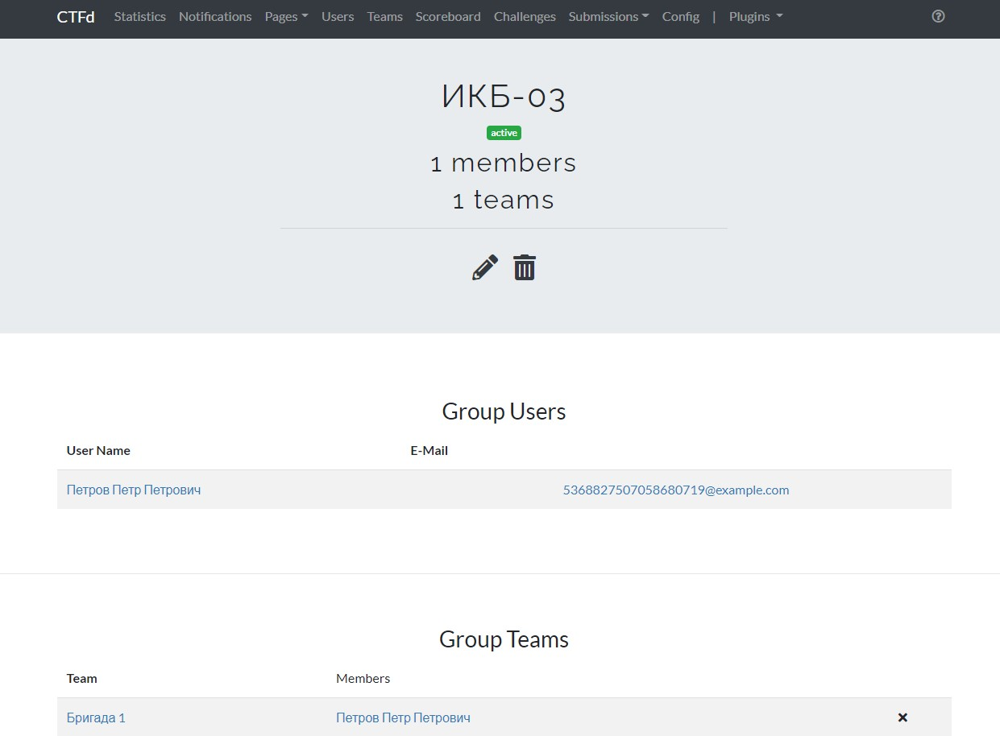
_Group page_

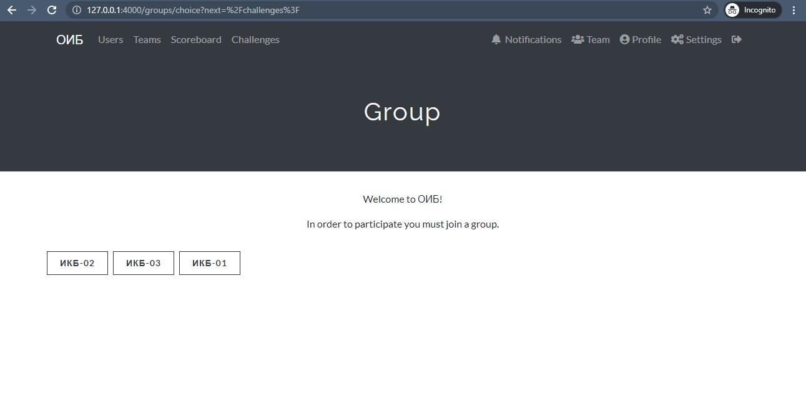
_User has to choose a group_

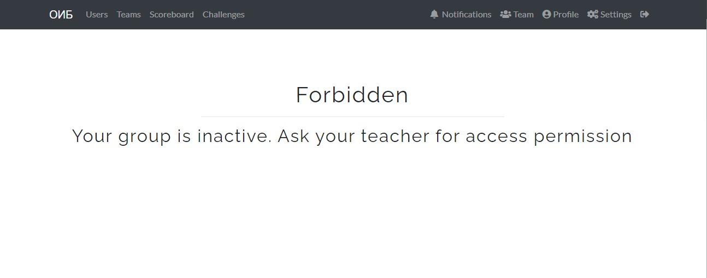
_If group is inactive displays an error message_

